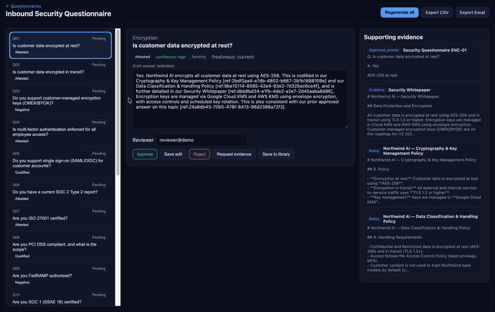

# TrustBot

[](https://github.com/jeffreezer/TrustBot/actions/workflows/ci.yml)
[](LICENSE)


An evidence-backed AI responder for security questionnaires. TrustBot drafts answers using only a company's verified, approved evidence. When it cannot support an answer, it returns a structured "needs human review" state instead of guessing. It is open source (MIT) and self-hostable, so your security data never has to leave your own infrastructure.

The design goal is to never fabricate. A naive LLM that auto-fills a security questionnaire will confidently overclaim, which is the worst failure mode when the answers are compliance attestations a customer relies on. TrustBot grounds every answer in retrieved, approved evidence, checks it with deterministic validators, and requires a person to approve it before anything leaves the system.



*Reviewing a security questionnaire: each answer carries an explicit outcome (attested / qualified / honest negative), a draft grounded in cited evidence, and anything unsupported is flagged for human review.*

## Highlights

This is a focused, end-to-end build of a trustworthy retrieval system for a setting where being wrong is expensive. The engineering reflects that.

- **Evidence-first, never fabricate.** Every affirmative answer has to cite a real, org-owned basis: a policy, a control, an attestation, or a prior human-approved answer. If none exists, the answer falls back to a `needs_input` state. The anti-fabrication check is deterministic, not left to the model's discretion.
- **Adaptive agentic retrieval.** A single, bounded agent with read-only, org-scoped tools searches, reads, and refines its query until it has support, then drafts. Compound questions are split into atomic sub-questions, answered independently, and recomposed with per-part citations.
- **Composite confidence.** Confidence blends relevance with source authority, cross-source agreement, and question coverage, rather than reusing the reranker score, which measures relevance only and is blind to how authoritative a source is.
- **Hybrid retrieval.** pgvector similarity search and Postgres full-text search, fused with reciprocal rank fusion and re-sorted by a CPU cross-encoder reranker.
- **Human in the loop.** A three-pane review workspace where nothing is emitted until a person approves it. Every action writes to an audit log.
- **Prompt-injection defense.** A four-layer approach (instruction and data separation, boundary detection, per-posture handling, and output validation) with an adversarial test suite that turns any successful injection into a failing build. See [SECURITY.md](SECURITY.md).
- **Measured, not asserted.** An offline, deterministic evaluation suite runs in CI. Any safety-gate failure, such as overclaiming, fabrication, or leakage, or a drop below the accuracy floor, fails the build.
- **Cloud-portable.** Postgres with pgvector and an S3-compatible storage adapter let the same containers run locally on MinIO, on GCP with Cloud SQL and GCS, or on AWS with RDS and S3, changing only configuration.

## Run it

```bash
cd trustbot && docker compose up --build      # http://localhost:3000
```

On start, the API applies migrations and seeds a synthetic demo company called Northwind AI, with a full evidence corpus (SOC 2 report, penetration test, PCI AOC, ISO certificate and Statement of Applicability, 16 policies, and a control catalog) plus a sample inbound questionnaire. Upload a questionnaire or use the seeded one, generate evidence-cited drafts, review them in the workspace, and export.

The demo uses a deterministic offline generator by default, so it needs no API key and no network. To draft with a real model, set `GENERATION_PROVIDER=anthropic` for the native Claude Messages API, or `=api` for any OpenAI-compatible server. See [trustbot/README.md](trustbot/README.md) for details.

## How it works

```
upload -> parse -> structure-aware chunk -> embed (BGE-M3, pgvector)
       -> hybrid retrieve (vector + keyword) -> fuse (RRF) -> rerank (cross-encoder)
       -> adaptive agent loop (search, refine, decompose)
       -> draft structured answer -> deterministic validators -> composite confidence
       -> human review (approve, edit, reject) -> export   [audit log throughout]
```

The product runs two postures over one shared engine. Respond mode (Milestone 1, answering our own inbound questionnaires) is built. Review mode (Milestone 2, assessing a vendor's submission for risk) reuses the same retrieval, validation, and injection-defense machinery, pointed outward.

Further reading:

- [SECURITY.md](SECURITY.md): the threat model and the injection-defense layers.
- [trustbot/ARCHITECTURE.md](trustbot/ARCHITECTURE.md): notable design decisions.
- [docs/05_TrustBot_Respond_Mode_Design.md](docs/05_TrustBot_Respond_Mode_Design.md) and [docs/06_TrustBot_Adaptive_Retrieval_Loop.md](docs/06_TrustBot_Adaptive_Retrieval_Loop.md): the respond-mode and agentic-loop designs.
- [docs/01_TrustBot_MVP_Portfolio_Plan.md](docs/01_TrustBot_MVP_Portfolio_Plan.md) through [docs/04_TrustBot_MVP_Build_Guide.md](docs/04_TrustBot_MVP_Build_Guide.md): scope, the vendor-review component, the full roadmap, and the build guide.

## Tech stack

- **Backend:** Python 3.12, FastAPI, SQLAlchemy 2 with Alembic, Pydantic v2.
- **Data:** PostgreSQL with pgvector, and Postgres full-text search.
- **AI:** a provider abstraction (Anthropic native, OpenAI-compatible, or a deterministic fake), BGE-M3 embeddings, a `ms-marco-MiniLM-L-6-v2` reranker on CPU, and a hand-rolled tool-calling agent loop.
- **Storage:** an S3-compatible adapter (MinIO, GCS, or S3).
- **Frontend:** Next.js (App Router), React, TypeScript.
- **Ops:** Docker Compose, pytest, and GitHub Actions CI with an evaluation gate.

## Status and roadmap

Milestone 1, the Questionnaire Responder, is complete: evidence-grounded drafting, adaptive retrieval with multi-part decomposition, approved-answer reuse, human-controlled document disclosure, a CI evaluation gate, and a tested prompt-injection defense.

- **Milestone 2, Vendor Review (TPRM):** the inverse problem. Assess third-party vendors' submitted questionnaires and evidence, with auditability and defensibility. It builds on the shared engine and the quarantine and injection defense already in place.
- **Milestone 3, Trust Center:** a self-service portal to publish the same evidence to customers under NDA.

For how a real organization would onboard its own evidence (Google Drive / Confluence / Glean), see [docs/08_TrustBot_Source_Connectors.md](docs/08_TrustBot_Source_Connectors.md). For an honest map of what is production-ready today versus what is still needed (authentication, evidence onboarding, real-document robustness, and operational hardening), see [docs/09_TrustBot_Production_Readiness.md](docs/09_TrustBot_Production_Readiness.md).

## License

[MIT](LICENSE). Copyright 2026 Jeff Goodwin.
